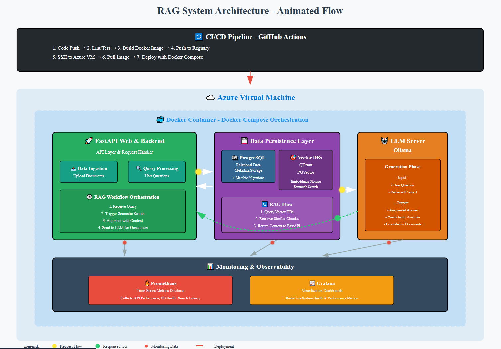

# 🧠 Retrieval-Augmented Generation (RAG) System

> **An open-source prototype of a Retrieval-Augmented Generation system built with FastAPI, LangChain, and Vector Databases — ready for deployment and scaling.**

---

## 🌟 Overview

This project demonstrates a complete **Retrieval-Augmented Generation (RAG)** pipeline for **intelligent question answering**, combining document ingestion, semantic retrieval, and LLM-powered responses.

> ✨ The result: An AI assistant that searches, understands, and answers using your **own knowledge sources**.

---

## 🎥 RAG Workflow


### 🧩 How It Works

1️⃣ **Data Collection** — Import PDFs, website content, or databases  
2️⃣ **Text Processing** — Split documents into smaller, meaningful chunks  
3️⃣ **Embeddings** — Transform text chunks into semantic vectors  
4️⃣ **Vector Database** — Store embeddings for fast similarity search  
5️⃣ **RAG in Action**
   - Finds relevant chunks for your question  
   - Sends context to the LLM  
   - Generates precise answers from your data  

---

## 🏗️ Architecture Highlights



| Component | Role |
|------------|------|
| **FastAPI** | Handles API requests, file uploads, and query orchestration |
| **LangChain** | Prepares text chunks and embeddings for retrieval |
| **Qdrant / PGVector** | Enables fast semantic search |
| **LLM Server (Ollama / OpenAI / Cohere)** | Generates context-aware answers |
| **MongoDB / PostgreSQL** | Persistent storage for documents and metadata |
| **Docker & Docker Compose** | Provides isolated and reproducible environment |
| **Prometheus & Grafana** | Real-time monitoring of the RAG pipeline |
| **Azure VM + GitHub Actions** | CI/CD for automated deployment |

---

This is a prototype of the implementation of the RAG model for question answering.

## Requiremnets

- Python 3.8 or later

### Install Dependencies

```bach
$ sudo apt update
$ sudo apt install libpq-dev gcc python3-dev
```


### Install Python unsing Conda

1) download and install Conda from [ https://repo.anaconda.com/archive/ ](I downloaded Anaconda3-2025.06-0-Linux-x86_64.sh )

2) Create a environment using this command : 
```bash
$ conda create -n rag-app python=3.8
```

3) Activate the envirment using this command : 
```bach
$ conda activate rag-app
```
## Installation

### Install the required packages

```bash
$ pip install -r requirements.txt
```

### Setup the environment variables

```bash
$ cp .env.example .env
```

### Run Alembic Migration

```bash
$ alembic upgrade head
```

Set your environment variables in the `.env` file. 

### Run Docker Compose services

```bash
$ cd docker
$ cp .env.example .env
```

-update '.env' with your credentials

```bash
$ cd docker
$ sudo docker compose up -d
```


### Run the FastAPI server
```bash
$ uvicorn main:app --reload --host 0.0.0.0 --port 5000
```